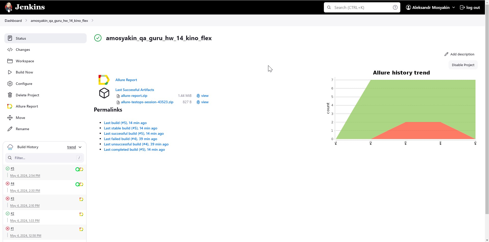
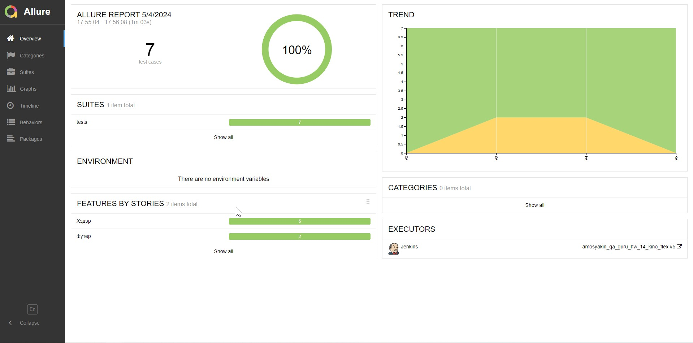
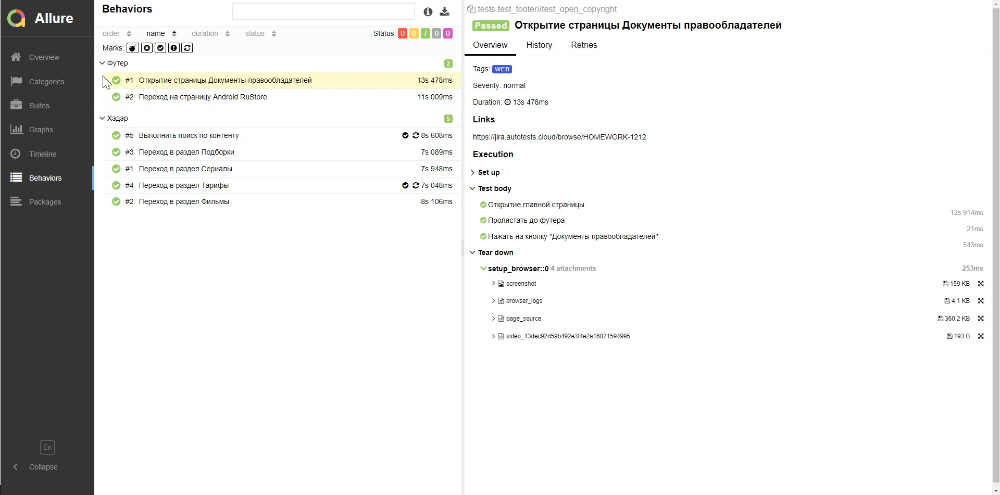
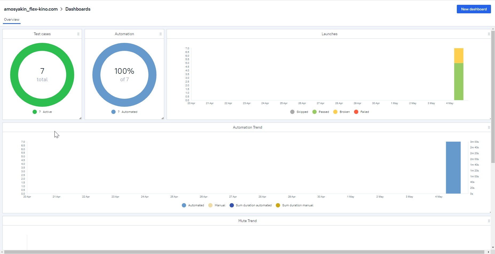
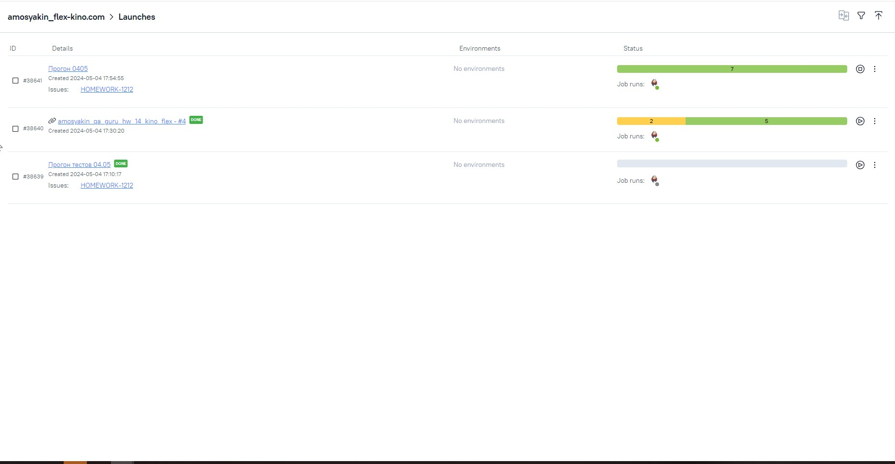
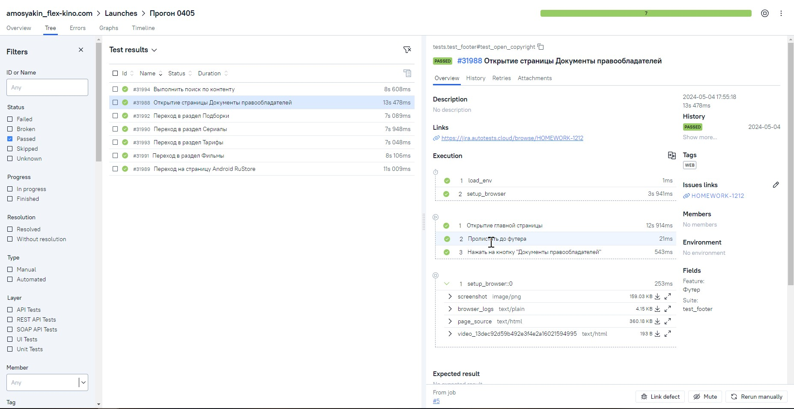
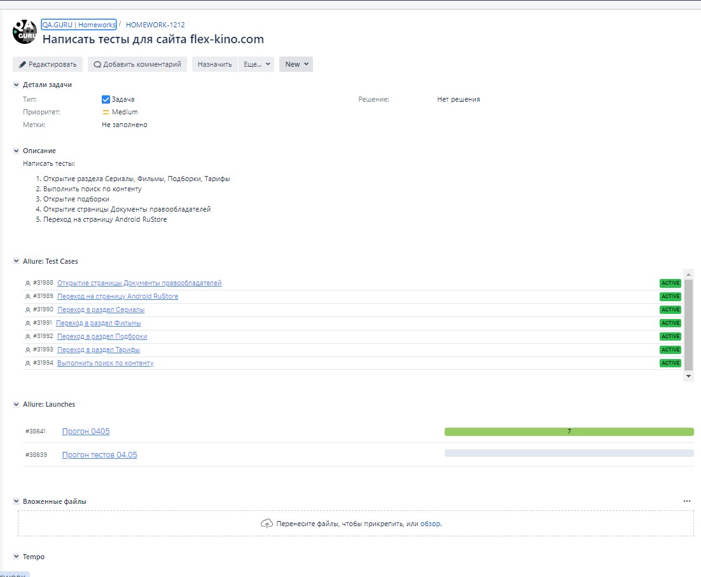
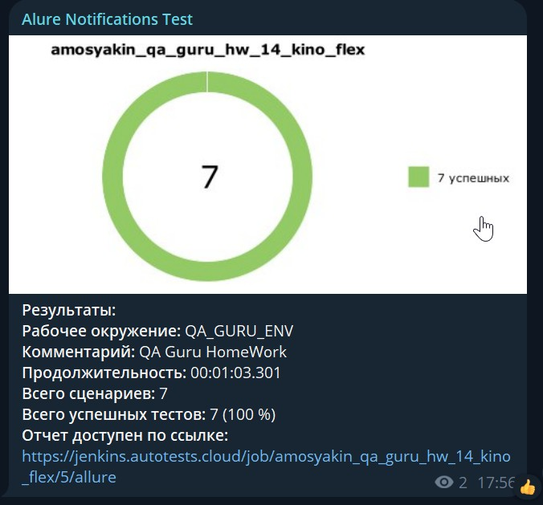

# Автотесты для веб-сайта онлайн-кинотеатра Flex

> https://flex-kino.com

## Особенности проекта
- Запуск web UI автотестов в Selenoid
- Сборка проекта в Jenkins
- Отчеты Allure Report
- Интеграция с Allure TestOps
- Оповещения о тестовых прогонах в Telegram
- Отчеты с видео, скриншотом, логами, исходной моделью разметки страницы
- Автоматизация отчетности о тестовых прогонах и тест-кейсах в Jira

## Список проверок, реализованных в web UI автотестах
- Переход по разделам в Хэдэре:
  - Сериалы
  - Фильмы
  - Подборки
  - Тарифы
- Поиск контента
- Переход в ссылкам в футере:
  - Документы правообладателей
  - Страница RuStore для Anroid-приложения

## Используемый стэк
          

## Запуск тестов из терминала
### Для запуска всех автотестов выполнить в cli:
> python -m venv .venv  
> source .venv/bin/activate   
> pip install -r requirements.txt   
> pytest -s -v

### Получение отчета allure:
> allure serve allure-results

## Проект в Jenkins
> [Jenkins](https://jenkins.autotests.cloud/job/amosyakin_qa_guru_hw_14_kino_flex/)

### Запуск автотестов в Jenkins:
1. Открыть [проект](https://jenkins.autotests.cloud/job/amosyakin_qa_guru_hw_14_kino_flex/)

2. Нажать кнопку "Build Now"

## Allure отчет
### [Общие результаты](https://jenkins.autotests.cloud/job/amosyakin_qa_guru_hw_14_kino_flex/5/allure/)

### [Результат прохождения теста](https://jenkins.autotests.cloud/job/amosyakin_qa_guru_hw_14_kino_flex/5/allure/#behaviors)

## Интеграция с Allure TestOps
> [Allure TestOps](https://allure.autotests.cloud/project/4214/dashboards)

### [Дашбоард](https://allure.autotests.cloud/project/4214/dashboards)

### [История запусков тестовых наборов](https://allure.autotests.cloud/project/4214/launches)

### [Отображение тест кейса](https://allure.autotests.cloud/project/4214/test-cases/31994?treeId=8254)

## Интеграция с Jira
### [Ссылка на проект](https://jira.autotests.cloud/browse/HOMEWORK-1212)

## Оповещения в Telegram

## Видео прохождения автотестов

